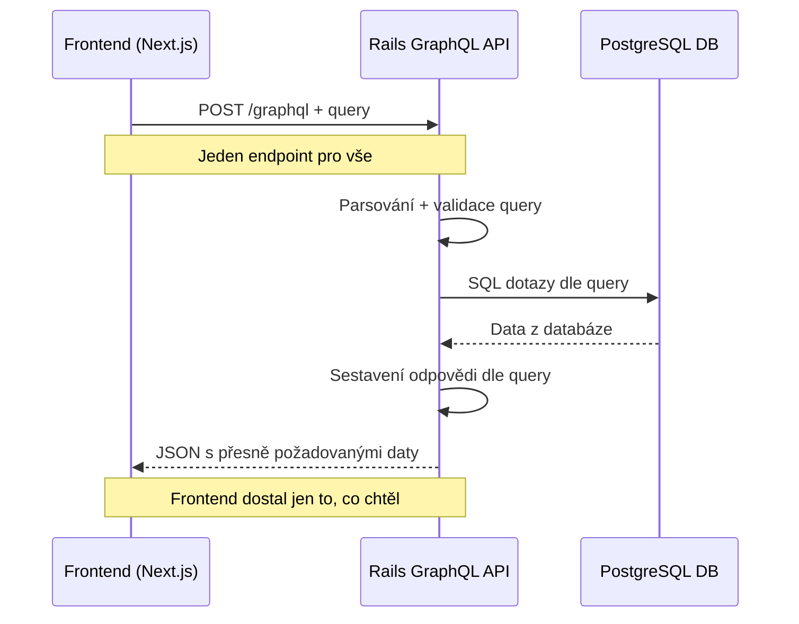
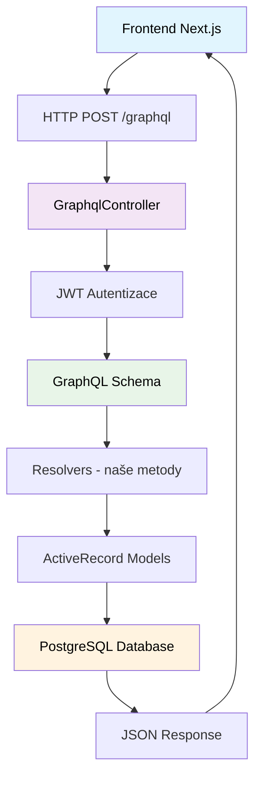
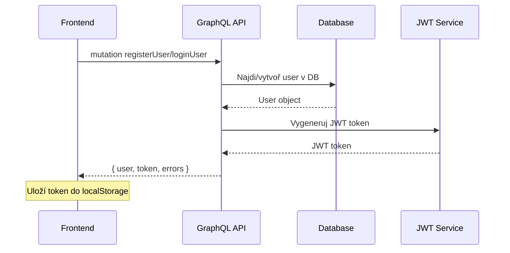
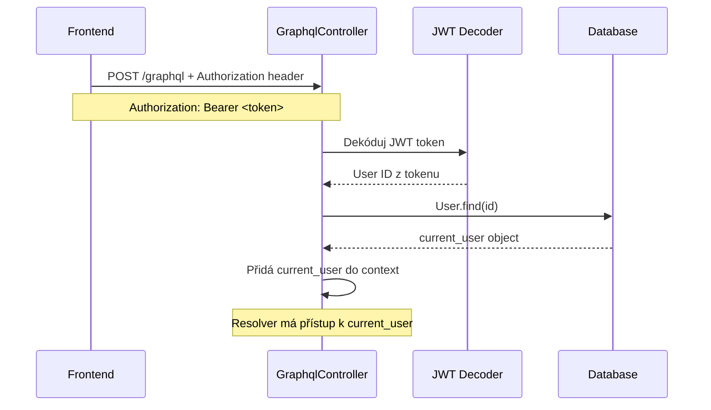
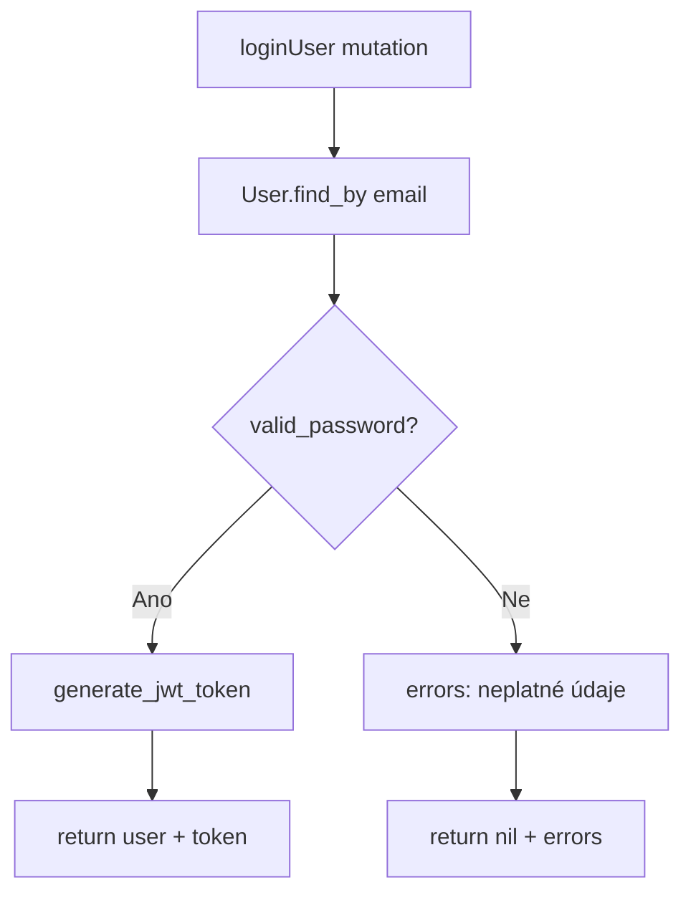
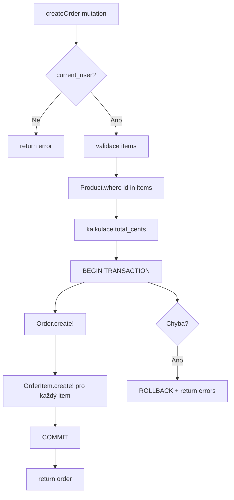

# 🚀 GraphQL API Průvodce - Lootea B2B Backend

Kompletní referenční průvodce jak funguje GraphQL API v našem Rails projektu.

---

## 📋 Obsah
- [Jak GraphQL funguje](#-jak-graphql-funguje)
- [Architektura systému](#-architektura-systému)
- [Autentizace flow](#-autentizace-flow)
- [Typy dat](#-typy-dat)
- [Queries - čtení dat](#-queries---čtení-dat)
- [Mutations - zápis dat](#-mutations---zápis-dat)
- [Praktické příklady](#-praktické-příklady)
- [Testování](#-testování)
- [Chybové stavy](#-chybové-stavy)
- [Best practices](#-best-practices)

---

## 🔄 Jak GraphQL funguje

### Základní princip
GraphQL je **query language** - frontend si "objedná" přesně ta data, která potřebuje v jednom requestu.



### Porovnání s REST API

| **REST API** | **GraphQL API** |
|--------------|-----------------|
| `GET /products` | `query { products { name price } }` |
| `GET /users/1` | `query { user(id: 1) { email } }` |
| `POST /orders` | `mutation { createOrder(...) { id } }` |
| **Více requestů** | **Jeden request** |
| **Over-fetching** | **Přesná data** |
| **Více endpointů** | **Jeden endpoint** |

---

## 🏗 Architektura systému

### Celkový přehled


### Struktura souborů
```
app/graphql/
├── lootea_b2b_backend_schema.rb    # Hlavní schema
├── types/
│   ├── query_type.rb               # Root queries
│   ├── mutation_type.rb            # Root mutations
│   ├── product_type.rb             # Product GraphQL typ
│   ├── user_type.rb                # User GraphQL typ
│   ├── order_type.rb               # Order GraphQL typ
│   └── order_item_type.rb          # OrderItem GraphQL typ
└── mutations/
    ├── login_user.rb               # Přihlášení
    ├── register_user.rb            # Registrace
    └── create_order.rb             # Vytvoření objednávky
```

---

## 🔐 Autentizace flow

### 1. Registrace/Přihlášení


### 2. Autentizované requesty


### JWT Token struktur
```ruby
# Payload v JWT tokenu
{
  "sub": 123,           # User ID
  "iat": 1640995200     # Issued at timestamp
}

# V Rails controlleru
def current_user
  token = request.headers['Authorization']&.split(' ')&.last
  decoded = JWT.decode(token, secret_key)
  User.find(decoded.first['sub'])
end
```

---

## 📊 Typy dat

### ProductType
```ruby
field :id, ID, null: false
field :name, String, null: false
field :price_cents, Integer, null: false      # Pro přesnost
field :price_decimal, Float, null: false      # Pro frontend UX
field :currency, String, null: false
```

### UserType
```ruby
field :id, ID, null: false
field :email, String, null: false
field :role, String, null: false              # "customer" | "admin"
field :company_name, String, null: true
field :orders, [OrderType], null: false       # Association
```

### OrderType
```ruby
field :id, ID, null: false
field :total_cents, Integer, null: false
field :total_decimal, Float, null: false      # Helper field
field :status, String, null: false            # "pending" | "paid" | ...
field :is_pending, Boolean, null: false       # Computed field
field :items_count, Integer, null: false      # Computed field
field :order_items, [OrderItemType], null: false
```

---

## 🔍 Queries - čtení dat

### Seznam produktů
```graphql
query GetProducts {
  products {
    id
    name
    description
    priceDecimal
    currency
    available
  }
}
```

**Rails resolver:**
```ruby
def products
  Product.available.order(:name)
end
```

**SQL dotaz:**
```sql
SELECT * FROM products WHERE available = true ORDER BY name;
```

### Aktuální uživatel
```graphql
query CurrentUser {
  currentUser {
    id
    email
    role
    companyName
    orders {
      id
      totalDecimal
      status
    }
  }
}
```

**Rails resolver:**
```ruby
def current_user
  context[:current_user]  # Z JWT autentizace
end
```

### Nested data v jednom requestu
```graphql
query MyOrdersWithProducts {
  myOrders {
    id
    totalDecimal
    createdAt
    orderItems {
      quantity
      unitPriceDecimal
      product {
        name
        description
      }
    }
  }
}
```

**Výsledek:**
```json
{
  "data": {
    "myOrders": [
      {
        "id": "1",
        "totalDecimal": 598.0,
        "orderItems": [
          {
            "quantity": 2,
            "unitPriceDecimal": 299.0,
            "product": {
              "name": "Lootea Premium"
            }
          }
        ]
      }
    ]
  }
}
```

---

## ⚡ Mutations - zápis dat

### Přihlášení
```graphql
mutation LoginUser {
  loginUser(
    email: "tomas@example.com"
    password: "heslo123"
  ) {
    user {
      id
      email
      role
    }
    token
    errors
  }
}
```

**Rails resolver flow:**


### Vytvoření objednávky
```graphql
mutation CreateOrder {
  createOrder(
    items: [
      { productId: "1", quantity: 2 },
      { productId: "3", quantity: 1 }
    ]
    currency: "CZK"
  ) {
    order {
      id
      totalDecimal
      orderItems {
        quantity
        totalDecimal
        product {
          name
        }
      }
    }
    errors
  }
}
```

**Rails resolver flow:**


---

## 💻 Praktické příklady

### Frontend Next.js - Apollo Client
```javascript
// Query
const GET_PRODUCTS = gql`
  query GetProducts {
    products {
      id
      name
      priceDecimal
      currency
    }
  }
`;

const { data, loading } = useQuery(GET_PRODUCTS);

// Mutation s autentizací
const LOGIN_USER = gql`
  mutation LoginUser($email: String!, $password: String!) {
    loginUser(email: $email, password: $password) {
      user { id email }
      token
      errors
    }
  }
`;

const [loginUser] = useMutation(LOGIN_USER, {
  context: {
    headers: {
      authorization: token ? `Bearer ${token}` : "",
    }
  }
});
```

### cURL příklady
```bash
# Query bez autentizace
curl -X POST http://localhost:3000/graphql \
  -H "Content-Type: application/json" \
  -d '{"query": "{ products { id name priceDecimal } }"}'

# Mutation s autentizací
curl -X POST http://localhost:3000/graphql \
  -H "Content-Type: application/json" \
  -H "Authorization: Bearer YOUR_JWT_TOKEN" \
  -d '{"query": "mutation { createOrder(items: [{productId: \"1\", quantity: 2}]) { order { id } errors } }"}'
```

---

## 🧪 Testování

### 1. GraphiQL Interface
```
http://localhost:3000/graphiql
```

**Testovací sekvence:**
1. Registrace uživatele
2. Kopírování JWT tokenu
3. Nastavení Authorization header
4. Testování protected queries

### 2. Rails konzole
```ruby
# Vytvoření testovacích dat
user = User.create!(email: "test@example.com", password: "password123")
product = Product.create!(name: "Test Tea", price_cents: 29900, currency: "CZK")

# Testování GraphQL
result = LooteaB2bBackendSchema.execute(
  "{ products { id name priceDecimal } }"
)
puts result.to_json
```

### 3. Postman collection
```json
{
  "info": { "name": "Lootea GraphQL API" },
  "item": [
    {
      "name": "Products Query",
      "request": {
        "method": "POST",
        "url": "{{base_url}}/graphql",
        "header": [{"key": "Content-Type", "value": "application/json"}],
        "body": {
          "raw": "{\"query\": \"{ products { id name priceDecimal } }\"}"
        }
      }
    }
  ]
}
```

---

## ❌ Chybové stavy

### Validation errors
```json
{
  "data": {
    "createOrder": {
      "order": null,
      "errors": [
        "Musíte být přihlášeni pro vytvoření objednávky"
      ]
    }
  }
}
```

### GraphQL syntax errors
```json
{
  "errors": [
    {
      "message": "Field 'invalidField' doesn't exist on type 'ProductType'",
      "locations": [{"line": 2, "column": 5}]
    }
  ]
}
```

### JWT errors
```json
{
  "data": {
    "currentUser": null
  }
}
```

---

## 🎯 Best Practices

### 1. **Ceny - vždy v centech**
```ruby
# ✅ Správně
field :price_cents, Integer, null: false
field :price_decimal, Float, null: false

# ❌ Špatně
field :price, Float, null: false  # Float problémy!
```

### 2. **Helper fields pro UX**
```ruby
# Pro frontend pohodlí
field :is_pending, Boolean, null: false
def is_pending
  object.pending?
end

field :items_count, Integer, null: false
def items_count
  object.order_items.sum(:quantity)
end
```

### 3. **Error handling**
```ruby
def resolve(...)
  {
    order: order,
    errors: order.errors.full_messages  # Strukturované chyby
  }
rescue => e
  {
    order: nil,
    errors: [e.message]
  }
end
```

### 4. **Transaction safety**
```ruby
ActiveRecord::Base.transaction do
  order = Order.create!(...)
  items.each { |item| OrderItem.create!(...) }
  { order: order, errors: [] }
rescue => e
  { order: nil, errors: [e.message] }
end
```

### 5. **Security considerations**
```ruby
# Jen bezpečné fieldy v UserType
field :email, String, null: false
# field :encrypted_password  # ❌ NIKDY!

# Kontrola autentizace
def my_orders
  return [] unless context[:current_user]
  context[:current_user].orders
end
```

---

## 🔗 Užitečné odkazy

- **GraphiQL development:** `http://localhost:3000/graphiql`
- **GraphQL schema:** `app/graphql/lootea_b2b_backend_schema.rb`
- **Rails GraphQL gem:** https://graphql-ruby.org/
- **Apollo Client (frontend):** https://www.apollographql.com/docs/react/

---

## 🎓 Shrnutí výhod

### **Pro Backend vývojáře:**
- ✅ Jeden endpoint místo 20 REST routes
- ✅ Type safety a validace zadarmo
- ✅ Automatická dokumentace
- ✅ Flexibilní data fetching

### **Pro Frontend vývojáře:**
- ✅ Přesně ta data, která potřebuje
- ✅ Nested data v jednom requestu
- ✅ Intellisense a autocomplete
- ✅ Cached responses (Apollo Client)

### **Pro tým:**
- ✅ Schema jako smlouva mezi FE a BE
- ✅ GraphiQL jako living documentation
- ✅ Méně komunikace ohledně API změn
- ✅ Rychlejší vývoj nových features

---

**🚀 Teď máš kompletní přehled o tom, jak naše GraphQL API funguje!**